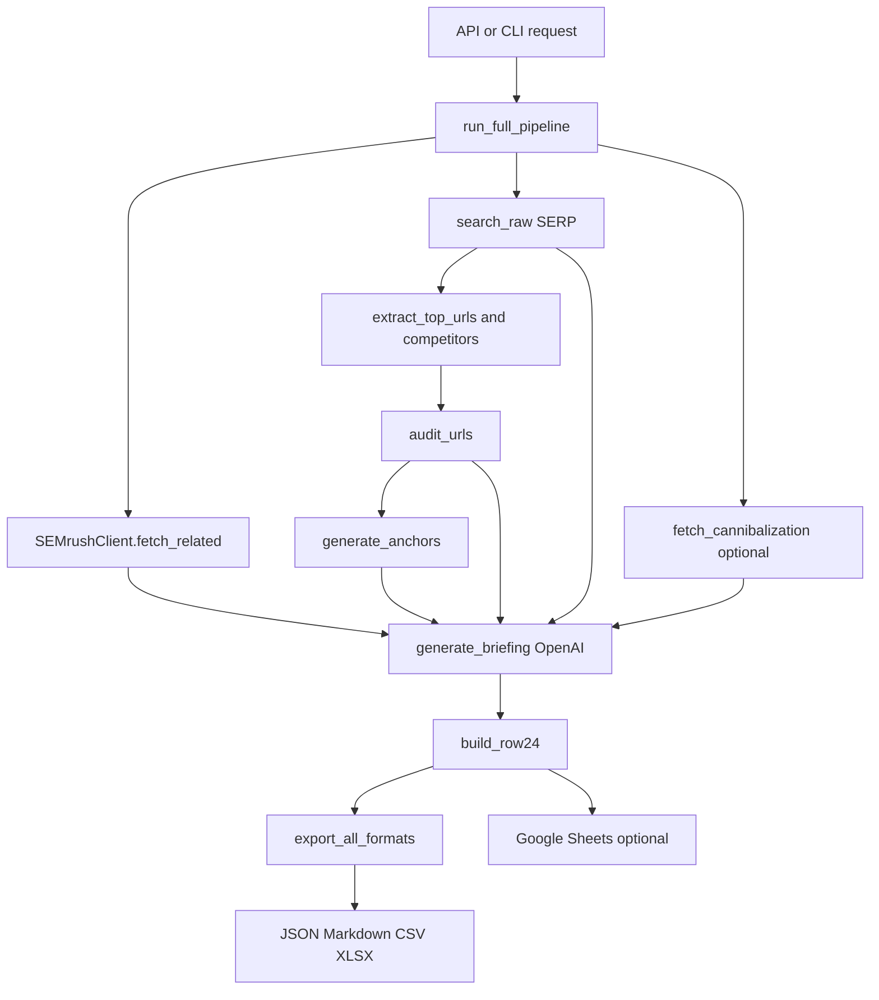

# Architecture

## Overview

SEO Brief Pipeline orquesta datos de keywords, SERP, competidores, GSC y OpenAI para producir un briefing SEO y una fila estructurada de 24 columnas.

El flujo principal vive en `seo_pipeline.pipeline.run_full_pipeline()`. La API FastAPI llama a esa funcion en background y escribe `status.json` para polling.



## Runtime Entry Points

- `api/main.py`: FastAPI app, API key validation, rate limit middleware, Sentry lifespan, background tasks and file downloads.
- `public/dashboard.html`: static operational UI for authenticated briefing and jobs administration.
- `client_manager.py`: interactive CLI for local client/project management and runs.
- `tools/cache_admin.py`: safe cache inspection and cleanup CLI.
- `seo_pipeline/pipeline.py`: core orchestration.
- `notebooks/`: exploratory notebooks; not the source of truth.

## API Layer

Endpoints:

- `GET /health`: no auth, returns API health and active client name.
- `GET /ops`: serves operational dashboard HTML from `public/dashboard.html`.
- `POST /briefing`: authenticated, creates a run, writes initial `status.json`, schedules `run_full_pipeline`.
- `GET /briefing/{run_id}`: reads `outputs/{run_id}/status.json`.
- `GET /jobs`: authenticated, lists recent job metadata from SQLite `JobStore` with limit/cursor/status/search filters.
- `GET /jobs/{run_id}`: authenticated, returns detailed metadata for one run, optional `status.json` snapshot and lifecycle `events`.
- `GET /jobs/{run_id}/events`: authenticated, paginated lifecycle event stream for one run.
- `GET /ops/audit-trail`: authenticated, paginated append-only operator audit trail.
- `POST /ops/audit-trail`: authenticated, appends one operator action/outcome event.
- `DELETE /jobs/{run_id}`: authenticated, deletes job metadata only (no artifact deletion).
- `POST /jobs/cleanup`: authenticated, triggers bounded cleanup of terminal jobs.
- `POST /jobs/{run_id}/retry`: authenticated, requeues failed jobs as new runs and persists lineage via `source_run_id`.
- `POST /jobs/{run_id}/cancel`: authenticated, marks queued/running jobs as logically canceled.
- `GET /outputs/{run_id}/{filename}`: authenticated by route policy, resolves paths under `outputs/` and only permits whitelisted filenames.

Security behavior:

- `API_KEY` is mandatory at import time and must be at least 20 characters.
- CORS is restricted to configured localhost origins.
- Rate limiting is in-memory per client IP.
- There is no `/static` mount exposing all generated files.
- Job metadata persistence uses `api/job_store.py` (SQLite), including startup retention cleanup via `JOB_STORE_RETENTION_DAYS`.
- Job metadata updates enforce state transitions in `JobStore` to avoid invalid lifecycle jumps.
- JobStore now uses a backend facade: SQLite is operational; PostgreSQL backend is scaffolded for migration but not yet enabled.
- Job lifecycle events are persisted in SQLite table `job_events` for operational traceability.
- Operator audit events are persisted in SQLite table `operator_audit_events`; the API intentionally exposes append/list only.
- Run metrics include a cost summary with provider call estimates and OpenAI token/cost estimates; job detail exposes this summary when metrics exist.
- SLO evaluation is a pure metrics layer in `seo_pipeline/slo.py`; it consumes `run_metrics.json` payloads and does not require external monitoring infrastructure.
- Cache operations are constrained to the resolved configured cache root via `seo_pipeline/cache_admin.py`.

## Configuration

Configuration uses JSON files, not YAML:

- `data/clients.json`: client credentials and defaults.
- `data/projects.json`: project domain, GSC property, Sheets id and output directory.
- `.env`: local environment variables loaded via `python-dotenv`; ignored by Git.

Main classes:

- `ClientConfig`: SEMrush, SerpAPI, OpenAI, DataForSEO, GSC and Sheets settings.
- `ProjectConfig`: project id, client id, base domain, GSC property, Sheets id and output directory.
- `PipelineConfig`: singleton returned by `get_config()`.

`PipelineConfig.get_output_dir()` writes to:

```text
{PIPELINE_ROOT or cwd}/{project.output_dir}/{project.project_id}/{run_id}
```

When the API launches a run, it passes its own `outputs/{run_id}` directory into the pipeline so status, metrics and downloads resolve from the same directory. Direct CLI/notebook runs still use the project output path above unless an explicit `output_dir` is provided.

## Core Pipeline

`run_full_pipeline()` performs:

1. Validate active client and project.
2. Create run output directory.
3. SEMrush keyword fetch through `SemrushClient.fetch_related`.
4. SERP fetch through `search_raw`.
5. Top URL extraction and competitor domain extraction.
6. Competitor content audit through `audit_urls`.
7. Optional GSC cannibalization through `fetch_cannibalization`.
8. Anchor generation through `generate_anchors`.
9. OpenAI structured briefing through `generate_briefing`.
10. Row 24 creation through `build_row24`.
11. Export with `export_all_formats`.
12. Optional Google Sheets upsert.

Stage contract note:

- The runtime now builds typed stage handoff snapshots (`PipelineInput`, `KeywordSet`, `CompetitorSet`, `EnrichmentSet`, `BriefingPlan`) for internal consistency and traceability.
- A quality-gate evaluation runs before briefing generation and is persisted in run metrics (`quality_gates`). Coverage gates can be enforced as hard failures with `QUALITY_GATES_STRICT=1`.
- Provider selection now uses a capability matrix for SERP (SerpAPI/DataForSEO), controlled by feature flags and provider order.
- A quorum policy evaluates partial-data coverage before briefing generation and records a decision (`continue`/`fail`) in metrics; enforcement is configurable.
- Prompt selection is now resolved through a versioned registry and the selected prompt metadata is persisted for traceability (`prompt_run`).
- Brief generation is now split into planner/writer steps: a deterministic planner artifact is built first, then consumed by the writer LLM call.

Transient vendor calls use `retry_call` with:

- `retries=3`
- `base_delay=2`
- `jitter=0.2`
- per-function warning callback

## Data Models

All primary contracts live in `seo_pipeline/models.py`.

- `SemrushKeyword`, `SemrushResults`
- `AuditEntry`, `AuditReport`, `SchemaSignals`
- `GscPage`, `GscQueryCannibal`, `GscCannibalization`
- `AnchorSet`
- `SEOBriefing`, `BriefingSection`, `FAQItem`, `InternalLink`, `ExternalLink`
- `SheetRow24`

The API request/response schemas live in `api/schemas.py`:

- `BriefingRequest`
- `BriefingResponse`
- `JobsCleanupRequest`
- admin response contracts (`JobsListResponse`, `JobDetailResponse`, `JobDeleteResponse`, `JobsCleanupResponse`, `JobRetryResponse`, `JobCancelResponse`)

## Vendor Integrations

- SEMrush: `seo_pipeline/vendors/semrush_io.py`.
- SerpAPI: `seo_pipeline/vendors/serp_io.py`.
- DataForSEO: `seo_pipeline/vendors/dataforseo_serp.py`.
- Google Search Console: `seo_pipeline/vendors/gsc_io.py`.
- Google Sheets: `seo_pipeline/vendors/sheets_io.py`.
- Scraper helper: `seo_pipeline/vendors/scrapers.py`.

See `docs/EXTERNAL_APIS.md` for credentials, calls and failure modes.

## Outputs

Typical generated files:

- `status.json`
- `run_metrics.json`
- `serp_raw.json`
- `audit_report.json`
- `briefing.json`
- `briefing.md`
- `row24.csv`
- `row24.xlsx`

Generated outputs are ignored by Git.

## CI And Guardrails

GitHub Actions runs:

```bash
python -m pip install --upgrade pip
pip install -e ".[test]"
pytest -q
```

CI also fails if tracked files include:

- `.env`
- `__pycache__`
- `*.pyc`
- secret-like patterns in source files

## Known Technical Debt

- Some legacy code comments/docstrings still need a controlled UTF-8 cleanup pass.
- Provider-neutral SERP normalization should be formalized into a typed contract.
- API jobs still use in-process background tasks; durable queue state is a production improvement.
- Credential validation can be centralized further, although required SEMrush, SERP and OpenAI checks already fail fast.
