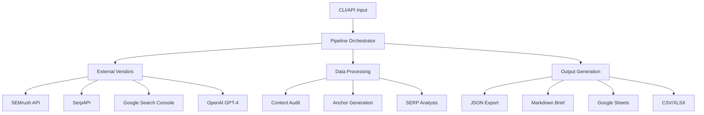
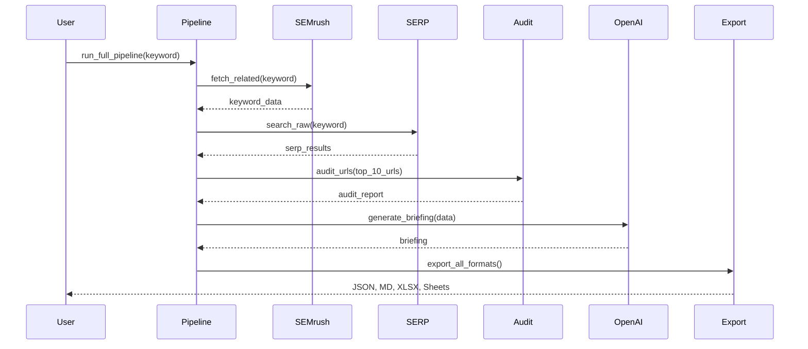

# SEO Brief Pipeline - Architecture Documentation

## Overview
The SEO Brief Pipeline is an automated system that generates comprehensive SEO content briefs by orchestrating data from multiple sources: SEMrush (keywords), SerpAPI (SERP analysis), Google Search Console (cannibalization), and OpenAI (AI-generated recommendations).

## High-Level Architecture



## Core Components

### 1. Pipeline Orchestrator (`pipeline.py`)
**Responsibility**: Coordinates the entire workflow from input to output.

**Key Function**: `run_full_pipeline()`
- **Input**: Keyword, target URL, configuration
- **Output**: Complete briefing in multiple formats
- **Flow**:
  1. Fetch keyword data from SEMrush
  2. Query SERP for top results
  3. Audit top 10 competitor URLs
  4. Fetch GSC cannibalization data (if available)
  5. Generate AI briefing via OpenAI
  6. Generate anchor texts
  7. Build 24-column spreadsheet row
  8. Export in all formats
  9. Upload to Google Sheets (optional)

### 2. Vendor Integrations (`vendors/`)

#### SEMrush (`semrush_io.py`)
- **Purpose**: Fetch keyword data and related keywords
- **Key Class**: `SemrushClient`
- **Features**:
  - Local caching with TTL
  - Unit balance checking
  - Error handling for API limits

#### SerpAPI (`serp_io.py`)
- **Purpose**: Real-time SERP analysis
- **Key Functions**: `search_raw()`, `extract_top_urls()`, `extract_competitor_domains()`
- **Features**:
  - Fallback to DataForSEO
  - AI Overview extraction
  - People Also Ask parsing

#### Google Search Console (`gsc_io.py`)
- **Purpose**: Detect keyword cannibalization
- **Key Function**: `fetch_cannibalization()`
- **Logic**: Position-weighted aggregation by impressions

#### Google Sheets (`sheets_io.py`)
- **Purpose**: Automated result upload
- **Key Class**: `SheetHandler`
- **Features**:
  - Idempotent upsert (no duplicates)
  - Auto-create tabs
  - Composite key matching

### 3. Data Processing

#### Content Audit (`audit/content_audit.py`)
- **Purpose**: Extract metadata from competitor URLs
- **Key Function**: `audit_urls()`
- **Extracted Data**:
  - Title, H1, meta description
  - Word count
  - Heading structure (H1-H6)
  - Schema.org signals

#### Anchor Generation (`anchors.py`)
- **Purpose**: Generate optimized anchor text variations
- **Key Function**: `generate_anchors()`
- **Strategy**:
  - N-gram extraction (2-6 words)
  - Scoring by keyword relevance, length, naturalness
  - Three categories: primary, secondary, internal

#### Briefing Generation (`blueprint.py`)
- **Purpose**: AI-powered SEO brief creation
- **Key Function**: `generate_briefing()`
- **Uses**: OpenAI + Instructor for structured outputs
- **Output**: `SEOBriefing` Pydantic model with:
  - Meta title/description
  - H1 and heading structure
  - FAQs, internal/external links
  - Multimedia suggestions

### 4. Export System (`exporter.py`)
**Purpose**: Multi-format export consistency

**Formats**:
- **JSON**: Full structured briefing
- **Markdown**: Human-readable brief
- **CSV/XLSX**: 24-column spreadsheet row
- **Google Sheets**: Direct upload

## Data Flow



## Configuration System (`config.py`)

### Architecture
- **Global Singleton**: `get_config()` returns shared instance
- **YAML-based**: `clients.yml` and `projects.yml`
- **Active Context**: One active client + one active project

### Structure
```python
Config
├── active_client: ClientConfig
│   ├── API keys (SEMrush, SerpAPI, OpenAI, etc.)
│   └── Service Account paths
└── active_project: ProjectConfig
    ├── base_domain
    ├── GSC property
    └── Google Sheets ID
```

## Models (`models.py`)
All data structures use **Pydantic v2** for validation:

- `SemrushResults`: Keyword data
- `SEOBriefing`: Complete AI-generated brief
- `AuditReport`: Multi-URL audit results
- `GscCannibalization`: Cannibalization report
- `SheetRow24`: 24-column export format
- `AnchorSet`: Generated anchor texts

## Utilities

### Text Processing (`utils/text.py`)
- `slugify()`: SEO-friendly URL slugs
- `normalize_ws()`: Whitespace normalization
- `truncate_smart()`: Preserve word boundaries
- `uniq_preserve()`: De-duplicate while preserving order

### I/O (`utils/io.py`)
- `save_json()`: UTF-8 JSON export
- `load_json()`: Safe JSON loading
- `ensure_dir()`: Recursive directory creation

### Logging (`utils/logging.py`)
- Centralized logger with rich formatting
- Log levels: DEBUG, INFO, WARNING, ERROR
- File + console output

## API Layer (`api/main.py`)

### Endpoints
- `POST /briefing`: Create new briefing (background task)
- `GET /briefing/{run_id}`: Check status
- `GET /health`: System health check

### Security
- **API Key Authentication**: `X-API-Key` header
- **Environment Variable**: `API_KEY` (default: `secret-token-2025`)

### Background Tasks
- FastAPI `BackgroundTasks` for async execution
- Status tracking via `status.json`
- Progress updates during pipeline execution

## Testing

### Test Structure
- `tests/test_api_background.py`: API endpoints + background tasks
- `tests/test_exporter.py`: Export functionality
- `tests/test_pipeline_errors.py`: Error handling

### Mocking Strategy
- Mock external APIs (SEMrush, SERP, OpenAI)
- Use `monkeypatch` to inject test data
- Verify status tracking and error propagation

## Deployment Considerations

### Environment Variables
```bash
# Required
SEMRUSH_TOKEN=your_token
SERPAPI_KEY=your_key
OPENAI_API_KEY=your_key

# Optional
API_KEY=your_api_key  # For API auth
DATAFORSEO_LOGIN=login
DATAFORSEO_PASSWORD=password
```

### Dependencies
- Python 3.10+
- Key packages: `fastapi`, `openai`, `instructor`, `gspread`, `pandas`

### Performance
- SEMrush caching reduces API calls
- Parallel URL auditing (ThreadPoolExecutor)
- Async API endpoints

## Extension Points

### Adding New Vendors
1. Create module in `vendors/`
2. Implement client class with caching
3. Add credentials to `ClientConfig`
4. Integrate in `pipeline.py`

### Custom Export Formats
1. Add function to `exporter.py`
2. Update `export_all_formats()` to include new format
3. Define any new models in `models.py`


## Performance Optimization

### Caching Strategies

#### SEMrush Cache
The pipeline implements automatic disk-based caching for SEMrush results:

```python
# Configured via TTL (Time-To-Live)
client = SemrushClient(
    token="your-token",
    cache_dir=Path("data/semrush_cache"),
    ttl_days=7  # Cache validity period
)
```

**Benefits**:
- Reduces API calls by ~80% for repeated keywords
- Saves API units
- Faster execution for similar queries

**Cache Management**:
```bash
# Clear cache manually
rm -rf data/semrush_cache/*

# Check cache size
du -sh data/semrush_cache/
```

#### Response Caching
Consider implementing Redis for production:

```python
import redis
from functools import wraps

redis_client = redis.Redis(host='localhost', port=6379, db=0)

def cache_response(ttl=3600):
    def decorator(func):
        @wraps(func)
        def wrapper(*args, **kwargs):
            key = f"{func.__name__}:{str(args)}:{str(kwargs)}"
            cached = redis_client.get(key)
            if cached:
                return json.loads(cached)
            
            result = func(*args, **kwargs)
            redis_client.setex(key, ttl, json.dumps(result))
            return result
        return wrapper
    return decorator
```

### Parallel Processing

#### URL Auditing
Optimize concurrent URL scraping:

```python
# Default: 5 workers
audit_urls(urls, max_workers=5)

# Aggressive (use with caution):
audit_urls(urls, max_workers=10)  # May trigger rate limits

# Conservative (slower but safer):
audit_urls(urls, max_workers=3)
```

**Trade-offs**:
- More workers = faster execution
- Too many workers = rate limiting, IP blocks
- Optimal: 5-8 workers for most cases

#### Batch Processing
Process multiple keywords efficiently:

```python
from concurrent.futures import ProcessPoolExecutor
import multiprocessing

def process_keywords_parallel(keywords, max_processes=4):
    """Process keywords in parallel processes."""
    with ProcessPoolExecutor(max_workers=max_processes) as executor:
        futures = {
            executor.submit(run_full_pipeline, kw): kw 
            for kw in keywords
        }
        
        for future in as_completed(futures):
            keyword = futures[future]
            try:
                future.result()
                print(f"✓ {keyword}")
            except Exception as e:
                print(f"✗ {keyword}: {e}")

# Process 100 keywords across 4 cores
keywords = load_keywords_from_csv("keywords.csv")
process_keywords_parallel(keywords, max_processes=4)
```

### API Rate Limit Management

#### Request Throttling
Implement rate limiting to avoid API bans:

```python
import time
from collections import deque

class RateLimiter:
    def __init__(self, max_calls, period):
        self.max_calls = max_calls
        self.period = period
        self.calls = deque()
    
    def __call__(self, func):
        def wrapper(*args, **kwargs):
            now = time.time()
            
            # Remove old calls
            while self.calls and self.calls[0] < now - self.period:
                self.calls.popleft()
            
            # Wait if limit reached
            if len(self.calls) >= self.max_calls:
                sleep_time = self.period - (now - self.calls[0])
                time.sleep(sleep_time)
            
            self.calls.append(time.time())
            return func(*args, **kwargs)
        return wrapper

# Usage
@RateLimiter(max_calls=10, period=60)  # 10 calls per minute
def call_api(url):
    return requests.get(url)
```

#### Exponential Backoff
Retry failed requests with increasing delays:

```python
import time
from random import uniform

def exponential_backoff(func, max_retries=3):
    for attempt in range(max_retries):
        try:
            return func()
        except Exception as e:
            if attempt == max_retries - 1:
                raise
            
            wait_time = (2 ** attempt) + uniform(0, 1)
            print(f"Retry {attempt + 1}/{max_retries} in {wait_time:.1f}s")
            time.sleep(wait_time)
```

### Memory Optimization

#### Streaming JSON
For large datasets, use streaming:

```python
import json

def stream_large_json(file_path):
    """Stream JSON instead of loading all at once."""
    with open(file_path) as f:
        for line in f:
            yield json.loads(line)

# Instead of:
# data = json.load(open("huge_file.json"))

# Use:
for record in stream_large_json("huge_file.jsonl"):
    process(record)
```

#### Generator Patterns
Use generators to reduce memory footprint:

```python
def process_keywords_generator(csv_path):
    """Process keywords one at a time."""
    with open(csv_path) as f:
        reader = csv.DictReader(f)
        for row in reader:
            yield run_full_pipeline(row['keyword'])

# Memory-efficient iteration
for result in process_keywords_generator("keywords.csv"):
    save_result(result)
```

### Database Optimization

#### Batch Inserts
For Google Sheets, batch updates are more efficient:

```python
from seo_pipeline.vendors.sheets_io import SheetHandler

def batch_upload_to_sheets(rows, sheet_id, tab_name):
    """Upload multiple rows at once."""
    handler = SheetHandler(sheet_id, "credentials/sheets-sa.json")
    ws = handler.get_or_create_worksheet(tab_name)
    
    # Batch update instead of individual inserts
    cell_list = ws.range(f'A2:X{len(rows)+1}')
    
    for i, row in enumerate(rows):
        for j, value in enumerate(row):
            cell_list[i * 24 + j].value = value
    
    ws.update_cells(cell_list, value_input_option='USER_ENTERED')
```

### Network Optimization

#### Connection Pooling
Reuse HTTP connections:

```python
import requests
from requests.adapters import HTTPAdapter
from urllib3.util.retry import Retry

def get_session():
    """Create session with connection pooling."""
    session = requests.Session()
    
    retry_strategy = Retry(
        total=3,
        backoff_factor=1,
        status_forcelist=[429, 500, 502, 503, 504]
    )
    
    adapter = HTTPAdapter(
        pool_connections=10,
        pool_maxsize=20,
        max_retries=retry_strategy
    )
    
    session.mount("http://", adapter)
    session.mount("https://", adapter)
    
    return session

# Reuse session across requests
session = get_session()
for url in urls:
    response = session.get(url)
```

### Profiling and Monitoring

#### Execution Time Tracking
Identify bottlenecks:

```python
import time
from contextlib import contextmanager

@contextmanager
def timer(name):
    start = time.time()
    yield
    elapsed = time.time() - start
    print(f"{name}: {elapsed:.2f}s")

# Usage in pipeline
with timer("SEMrush fetch"):
    semrush_data = client.fetch_related(keyword)

with timer("SERP analysis"):
    serp_data = search_raw(keyword)

with timer("URL audit"):
    audit_report = audit_urls(urls)
```

#### Memory Profiling
```python
from memory_profiler import profile

@profile
def run_full_pipeline(keyword):
    # ... pipeline code
    pass

# Run with:
# python -m memory_profiler script.py
```

### Recommended Configuration for Scale

#### High-Volume (1000+ keywords/day)
```python
# config.py settings
SEMRUSH_CACHE_TTL = 30  # days
MAX_AUDIT_WORKERS = 3   # conservative
SERP_NUM = 10           # reduce from 12
RELATED_LIMIT = 20      # reduce from 60
BATCH_SIZE = 50         # process in batches
```

#### Medium-Volume (100-500 keywords/day)
```python
SEMRUSH_CACHE_TTL = 7
MAX_AUDIT_WORKERS = 5
SERP_NUM = 12
RELATED_LIMIT = 40
BATCH_SIZE = 20
```

#### Low-Volume (<100 keywords/day)
```python
SEMRUSH_CACHE_TTL = 1
MAX_AUDIT_WORKERS = 8
SERP_NUM = 15
RELATED_LIMIT = 60
BATCH_SIZE = 10
```

### Cost Optimization

#### API Cost Breakdown (per keyword)
- **SEMrush**: 10 API units (cached after first call)
- **SerpAPI**: $0.002-0.005 per search
- **OpenAI GPT-4**: $0.01-0.03 per briefing
- **Google APIs**: Free (with quotas)

#### Optimization Tips
1. **Use cache aggressively** for dev/testing
2. **Reduce `related_limit`** to lower SEMrush units
3. **Use GPT-3.5-turbo** instead of GPT-4 for drafts
4. **Batch Sheets uploads** to reduce API calls
5. **Monitor quotas** daily to avoid overruns

## Best Practices

1. **Always use `get_config()`** to access configuration
2. **Cache vendor responses** when possible
3. **Use Pydantic models** for all structured data
4. **Log at appropriate levels** (DEBUG for data, ERROR for failures)
5. **Handle API failures gracefully** with retries and fallbacks
6. **Test with mocks** to avoid hitting real APIs
