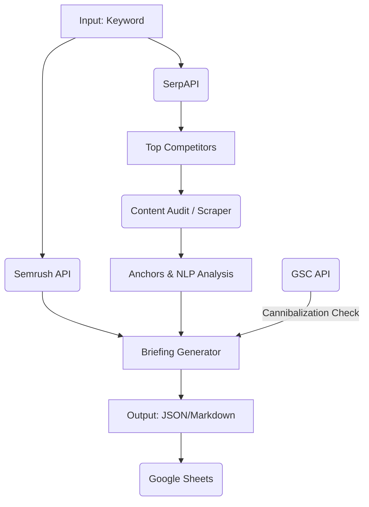

# SEO Briefing Pipeline 2025

An advanced, automated SEO pipeline that generates comprehensive content briefings using **Semrush**, **SerpAPI**, **OpenAI**, and **Google Search Console**.

## 🚀 Features

- **Automated Keyword Research**: Fetches related keywords and search volumes via Semrush.
- **SERP Analysis**: Analyzes top competitors in real-time using SerpAPI.
- **Content Audit**: Scrapes and audits top competitor content (H1, H2, word count, etc.).
- **Cannibalization Detection**: Checks Google Search Console for existing pages competing for the same keyword.
- **AI Briefing Generation**: Uses OpenAI (GPT-4o) to generate detailed content briefs with structured output.
- **Google Sheets Integration**: Automatically exports results to Google Sheets.
- **API & CLI**: Available as both a REST API (FastAPI) and an interactive CLI.

## 🛠️ Architecture



## 📦 Setup

1.  **Clone the repository**:
    ```bash
    git clone <repo-url>
    cd SEO-Brief-Pipeline
    ```

2.  **Install dependencies**:
    ```bash
    pip install -r requirements.txt
    ```

3.  **Environment Configuration**:
    Copy `.env.example` to `.env` and fill in your API keys:
    ```bash
    cp .env.example .env
    ```
    Required keys:
    - `SEMRUSH_TOKEN`
    - `SERPAPI_KEY`
    - `OPENAI_API_KEY`
    - `DFSP_USERNAME` / `DFSP_PASSWORD` (DataForSEO - Optional)

    *Note: For GSC and Sheets integration, place your Service Account JSON files in `credentials/`.*

## 💻 Usage

### Interactive CLI
The easiest way to manage clients, projects, and runs.
```bash
python client_manager.py
```

### REST API
Start the API server:
```bash
uvicorn api.main:app --reload
```
- **POST** `/briefing`: Trigger a new briefing run.
- **GET** `/briefing/{run_id}`: Check status.
- **GET** `/outputs/{run_id}/...`: Download generated files.

## 📂 Project Structure

- `seo_pipeline/`: Core logic (vendors, audit, blueprint generation).
- `api/`: FastAPI application.
- `data/`: Local storage for clients/projects JSONs.
- `outputs/`: Generated artifacts (briefings, raw data).
- `tests/`: Pytest suite.

## 🧪 Testing

Run the test suite:
```bash
pytest
```
