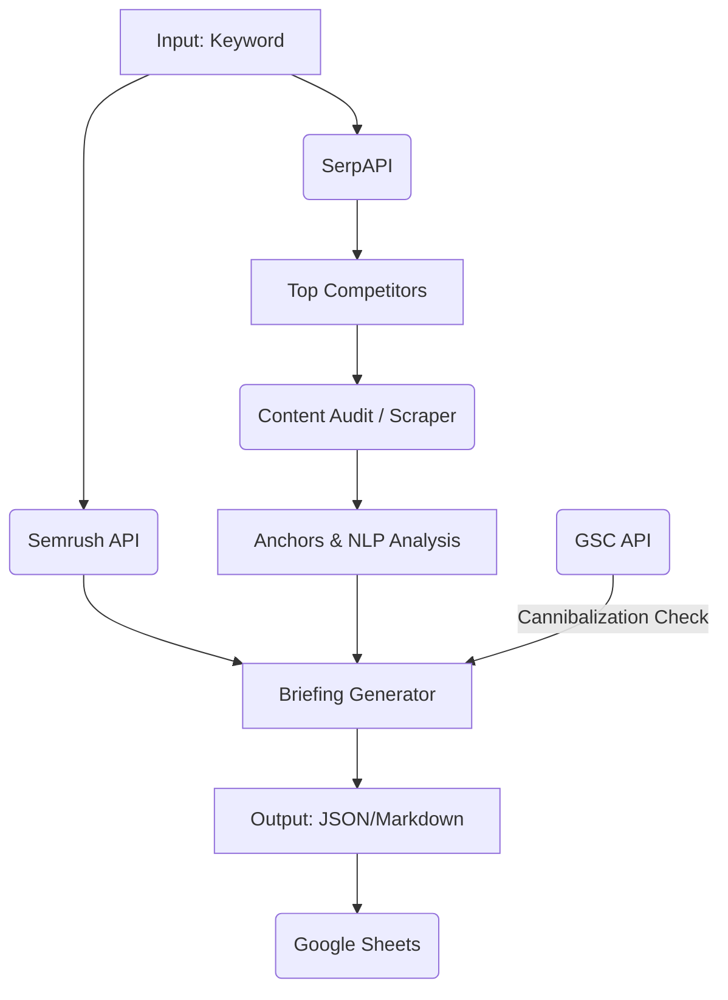

# SEO Briefing Pipeline 2025

An advanced, automated SEO pipeline that generates comprehensive content briefings using **Semrush**, **SerpAPI**, **OpenAI**, and **Google Search Console**.

## Documentation
- 📘 **[Architecture Guide](ARCHITECTURE.md)**: Detailed component descriptions, data flow, and performance optimization
- 🚀 **[Tutorials](TUTORIALS.md)**: Step-by-step guides for common use cases
- 🔧 **[Troubleshooting](TROUBLESHOOTING.md)**: Common issues and solutions
- 📡 **[API Reference](#api-usage)**: See below for API endpoints
- 📁 **[Project Structure](#project-structure)**: File organization

## Features

- **Automated Keyword Research**: Fetches related keywords and search volumes via Semrush.
- **SERP Analysis**: Analyzes top competitors in real-time using SerpAPI.
- **Content Audit**: Scrapes and audits top competitor content (H1, H2, word count, etc.).
- **Cannibalization Detection**: Checks Google Search Console for existing pages competing for the same keyword.
- **AI Briefing Generation**: Uses OpenAI (GPT-4o) to generate detailed content briefs with structured output.
- **Google Sheets Integration**: Automatically exports results to Google Sheets.
- **API & CLI**: Available as both a REST API (FastAPI) and an interactive CLI.

## 🛠️ Architecture



## 📦 Setup

1.  **Clone the repository**:
    ```bash
    git clone <repo-url>
    cd SEO-Brief-Pipeline
    ```

2.  **Install dependencies**:
    ```bash
    pip install -r requirements.txt
    ```

## ⚡ Quick Commands

```bash
# Reiniciar pipeline (limpia cache + inicia client manager)
./restart_pipeline.sh

# Ejecutar client manager directamente
python client_manager.py

# Ejecutar API server
uvicorn api.main:app --reload

# Ejecutar tests
pytest

# Limpiar cache Python manualmente
find . -type d -name "__pycache__" -exec rm -rf {} + 2>/dev/null
```

3.  **Environment Configuration** (⚠️ IMPORTANT for security):
    
    a. Copy `.env.example` to `.env`:
    ```bash
    cp .env.example .env
    ```
    
    b. Edit `.env` and fill in your API credentials (**never commit `.env` to Git**):
    ```env
    SEMRUSH_TOKEN=your_token_here
    SERPAPI_KEY=your_key_here
    OPENAI_API_KEY=sk-proj-your_key_here
    API_KEY=your_strong_api_key_here  # Must be >= 20 chars
    DFSP_USERNAME=your_username       # Optional
    DFSP_PASSWORD=your_password       # Optional
    ```
    
    c. **Security Best Practices**:
    - ✅ **DO**: Store credentials in `.env` (local, never committed)
    - ✅ **DO**: Use environment variables in production (Docker, cloud platforms)
    - ❌ **DON'T**: Hardcode secrets in Python files
    - ❌ **DON'T**: Commit `.env` to version control (already in `.gitignore`)
    - ⚠️ **ROTATE keys** if ever exposed publicly
    
    d. **Service Accounts** (Google Cloud):
    For GSC (Google Search Console) and Google Sheets integration, place your Service Account JSON files in:
    - `credentials/client_secret.json` (OAuth credentials)
    - `credentials/token_gsc.json` (cached token)
    
    See [TUTORIALS.md](TUTORIALS.md) for setup instructions.

## 💻 Usage

### Interactive CLI
The easiest way to manage clients, projects, and runs.
```bash
python client_manager.py
```

### API Usage

Start the API server:
```bash
uvicorn api.main:app --reload
```

The API is available at `http://localhost:8000`. All endpoints require authentication via API key.

#### Authentication
Include the API key in the `X-API-Key` header:
```bash
export API_KEY="your-secret-key"  # Set in .env or environment
```

#### Create a Briefing

**Endpoint**: `POST /briefing`

**curl Example**:
```bash
curl -X POST "http://localhost:8000/briefing" \
  -H "Content-Type: application/json" \
  -H "X-API-Key: secret-token-2025" \
  -d '{
    "keyword": "marketing digital",
    "target_url": null,
    "upload_to_sheets": false,
    "related_limit": 30,
    "serp_num": 10
  }'
```

**Python Example**:
```python
import requests

response = requests.post(
    "http://localhost:8000/briefing",
    headers={"X-API-Key": "secret-token-2025"},
    json={
        "keyword": "marketing digital",
        "target_url": None,
        "upload_to_sheets": False,
        "related_limit": 30,
        "serp_num": 10
    }
)

data = response.json()
run_id = data["run_id"]
print(f"Briefing started: {run_id}")
```

**Response**:
```json
{
  "run_id": "20251124_210530",
  "keyword": "marketing digital",
  "output_dir": "outputs/20251124_210530",
  "files": {
    "status": "/outputs/20251124_210530/status.json"
  }
}
```

#### Check Status

**Endpoint**: `GET /briefing/{run_id}`

**curl Example**:
```bash
curl "http://localhost:8000/briefing/20251124_210530"
```

**Python Example** (with polling):
```python
import time

def wait_for_completion(run_id, timeout=300):
    start = time.time()
    while time.time() - start < timeout:
        resp = requests.get(f"http://localhost:8000/briefing/{run_id}")
        status = resp.json()
        
        if status["status"] == "done":
            print("✓ Briefing complete!")
            return status
        elif status["status"] == "failed":
            print(f"✗ Failed: {status.get('message')}")
            return status
        
        print(f"⏳ {status.get('step', 'processing')}...")
        time.sleep(5)
    
    raise TimeoutError("Briefing took too long")

result = wait_for_completion(run_id)
```

**Response** (in progress):
```json
{
  "status": "running",
  "step": "3/8 Auditando competidores...",
  "message": "Processing"
}
```

**Response** (complete):
```json
{
  "status": "done",
  "step": "completed",
  "message": "Pipeline completado",
  "files": {
    "json": "/outputs/20251124_210530/briefing.json",
    "markdown": "/outputs/20251124_210530/briefing.md",
    "xlsx": "/outputs/20251124_210530/row24.xlsx"
  }
}
```

#### Download Results

**Endpoints**: 
- `GET /outputs/{run_id}/{filename}`

**curl Example**:
```bash
# Download JSON briefing
curl "http://localhost:8000/outputs/20251124_210530/briefing.json" -o briefing.json

# Download Markdown
curl "http://localhost:8000/outputs/20251124_210530/briefing.md" -o briefing.md
```

#### Error Responses

**401 Unauthorized** (missing API key):
```json
{
  "detail": "Could not validate credentials"
}
```

**404 Not Found** (invalid run_id):
```json
{
  "detail": "Run_id no encontrado"
}
```

**500 Internal Server Error**:
```json
{
  "detail": "SEMrush: solo 50 units (mínimo requerido: 100)"
}
```


## 📂 Project Structure

- `seo_pipeline/`: Core logic (vendors, audit, blueprint generation).
- `api/`: FastAPI application.
- `data/`: Local storage for clients/projects JSONs.
- `outputs/`: Generated artifacts (briefings, raw data).
- `tests/`: Pytest suite.

## 🧪 Testing

Run the test suite:
```bash
pytest
```
