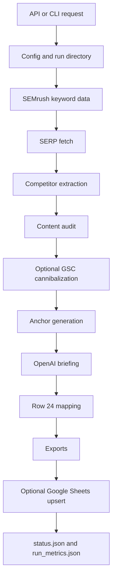

# Pipeline Deep Dive

This document describes the runtime path of one SEO briefing run and the improvement plan at step level. It is intended for future agents and maintainers.

## End-To-End Flow

Main implementation:

- `api/main.py`: API lifecycle, auth, background task, status and downloads.
- `seo_pipeline/pipeline.py`: orchestration and stage boundaries.
- `seo_pipeline/models.py`: Pydantic contracts between stages.
- `seo_pipeline/vendors/`: external provider adapters.
- `seo_pipeline/audit/content_audit.py`: competitor page audit.
- `seo_pipeline/blueprint.py`: OpenAI structured briefing generation.
- `seo_pipeline/exporter.py`: final files.

## Stage 0 - Request, Auth And Run Setup

Entry points:

- API: `POST /briefing` in `api/main.py`.
- CLI/notebooks: `run_full_pipeline()` in `seo_pipeline/pipeline.py`.

Inputs:

- `keyword`
- optional `target_url`
- optional `max_results`
- optional `country`, `language`
- optional `upload_to_sheets`

Outputs:

- `run_id`
- `status.json`
- run output directory

Current behavior:

- API requires `X-API-Key`.
- API creates `outputs/{run_id}` and passes that directory to the pipeline.
- CLI runs default to `{project.output_dir}/{project_id}/{run_id}` unless `output_dir` is passed.
- `status.json` captures coarse state; `run_metrics.json` captures per-stage timing and counts.

Risks:

- API jobs are in-process background tasks. A process restart can lose a queued/running job.
- Status files are useful for polling but are not a durable queue.

Improvements:

- Persist jobs in SQLite or Redis with retryable state transitions.
- Add idempotency keys for repeated `POST /briefing` requests.
- Add request-level validation for incompatible options before scheduling the job.

Acceptance:

- Restarting the API does not lose pending work.
- Duplicate requests can be detected or resumed by idempotency key.
- Failed runs expose a stable error category without printing secrets.

## Stage 1 - Configuration And Credential Preflight

Main files:

- `seo_pipeline/config.py`
- `data/clients.json`
- `data/projects.json`
- `.env` for local secret values, never committed.

Current behavior:

- Active client and project are loaded through the singleton `get_config()`.
- Required providers fail fast before execution:
  - SEMrush requires `SEMRUSH_TOKEN`.
  - SERP requires `SERPAPI_KEY` or complete DataForSEO credentials.
  - OpenAI requires `OPENAI_API_KEY`.
- Optional providers remain optional:
  - GSC.
  - Google Sheets.
  - Sentry.

Risks:

- `data/*.json` can drift from real deployments.
- Some credential validation is still distributed between config and provider adapters.

Improvements:

- Add a single `validate_runtime_requirements()` function that returns structured missing-capability errors.
- Validate `clients.json` and `projects.json` with stricter Pydantic models at startup.
- Add a CLI command to inspect active config without printing secret values.

Acceptance:

- Invalid config fails before network calls.
- Error messages name missing variables but never their values.
- Tests cover complete, partial and absent provider credentials.

## Stage 2 - SEMrush Keyword Data

Main file:

- `seo_pipeline/vendors/semrush.py`

Function:

- `SemrushClient.fetch_related()`

Inputs:

- keyword.
- SEMrush token.
- database/country setting.

Outputs:

- `SemrushResults`.
- principal `SemrushKeyword`.
- secondary keywords.

Current behavior:

- Uses a retry helper around the vendor call.
- Provides search volume and related terms for downstream briefing context.

Risks:

- Unit consumption is external and should be visible in operations.
- Vendor errors may be transient, quota-related or credential-related but currently converge into generic failures.

Improvements:

- Normalize vendor errors into categories: auth, quota, rate limit, timeout, malformed response.
- Write SEMrush unit/cost metadata when returned by the API.
- Cache keyword responses with TTL keyed by keyword, country and language.

Acceptance:

- Retried errors are visible in logs and metrics.
- Quota failures are not retried as generic transient errors.
- Cache can be disabled for debugging.

## Stage 3 - SERP Acquisition

Main files:

- `seo_pipeline/vendors/serp_io.py`
- `seo_pipeline/vendors/dataforseo.py`

Functions:

- `search_raw()`
- DataForSEO fallback helpers.

Inputs:

- keyword.
- country and language.
- SerpAPI key or DataForSEO credentials.

Outputs:

- raw SERP JSON.
- `serp_raw.json`.

Current behavior:

- SerpAPI is primary when configured.
- DataForSEO can be used as fallback when complete credentials are present.
- Fallback is guarded so missing DataForSEO credentials do not trigger broken client creation.

Risks:

- SERP providers have different schemas; normalization can silently lose fields.
- AI Overview data may be absent, partial or provider-specific.

Improvements:

- Introduce a provider-neutral `SerpSnapshot` model.
- Store provider name, request params and normalized result counts in metrics.
- Add golden fixture tests for SerpAPI and DataForSEO responses.

Acceptance:

- Downstream stages consume one stable normalized contract.
- Missing AI Overview is explicit, not ambiguous.
- Provider changes break tests before production behavior changes.

## Stage 4 - Competitor URL And Domain Extraction

Main file:

- `seo_pipeline/vendors/serp_io.py`

Functions:

- top URL extraction helpers.
- `extract_competitor_domains()`.

Inputs:

- raw or normalized SERP result.
- project `base_domain`.

Outputs:

- top competitor URLs.
- competitor domains excluded from internal links.

Current behavior:

- Domains are normalized before comparison, so `https://example.com/`, `example.com` and subdomains are handled consistently.

Risks:

- SERP pages can contain host variants, redirects, AMP URLs and tracking URLs.
- Exact domain exclusion may not cover all brand-owned domains.

Improvements:

- Add configurable owned-domain aliases per project.
- Resolve canonical final URLs only when needed and with timeout protection.
- Store excluded domains and reasons in metrics.

Acceptance:

- Multi-domain brands can exclude all owned domains.
- URL parsing tests cover schemes, paths, ports, subdomains, AMP and malformed URLs.

## Stage 5 - Competitor Content Audit

Main file:

- `seo_pipeline/audit/content_audit.py`

Function:

- `audit_urls()`

Inputs:

- competitor URLs.

Outputs:

- `AuditReport`.
- `audit_report.json`.

Current behavior:

- Fetches HTML and extracts status code, title, H1, headings and word count.
- Preserves input URL order in results.
- Does not require Piloterr to be configured.

Risks:

- HTML fetches can be blocked, slow or return bot pages.
- Content extraction is basic and may miss rendered JavaScript content.
- Parallel fetches can stress small sites if limits increase.

Improvements:

- Add per-host concurrency limits and robots-aware policy if needed.
- Add optional Playwright rendering for JS-heavy pages.
- Add extraction quality signals: body text length, duplicate headings, canonical URL, meta description.

Acceptance:

- Audit reports mark fetch failures per URL without failing the full pipeline when enough competitors remain.
- Rendered extraction is opt-in and tested with fixtures.
- Metrics include success/failure counts and slowest URL.

## Stage 6 - Optional GSC Cannibalization

Main file:

- `seo_pipeline/vendors/gsc_io.py`

Function:

- `fetch_cannibalization()`

Inputs:

- GSC property.
- service account JSON path.
- keyword/date window.

Outputs:

- `CannibalizationReport`.

Current behavior:

- Runs only when GSC credentials and property are configured.
- Maps Search Console clicks into the `GscPage.clicks` model field.
- Failure is logged and stored in metrics but does not block the run.

Risks:

- Service account permissions often fail at deployment time.
- Date windows and property format differences can produce empty data that looks like success.

Improvements:

- Add a GSC connectivity preflight endpoint/CLI command.
- Include requested date range and row count in metrics.
- Distinguish empty result from API failure in the briefing context.

Acceptance:

- A missing GSC permission produces a clear diagnostic.
- Empty data is represented as `skipped_empty` or equivalent metadata.

## Stage 6b - Optional GA4 URL Metrics

Main file:

- `seo_pipeline/vendors/ga4_io.py`

Function:

- `fetch_url_metrics()`

Inputs:

- GA4 property ID.
- service account JSON path.
- target URL.
- date window.

Outputs:

- `ga4_url_metrics` in the pipeline result.
- `ga4` stage in `run_metrics.json`.

Current behavior:

- Runs only when `target_url`, `ClientConfig.gsc_sa_path` and `ProjectConfig.ga4_property_id` are configured.
- Fetches sessions, users, page views, conversions and engagement rate for the exact page path.
- Failure is logged and stored in metrics but does not block the run.

Risks:

- GA4 service account access is separate from GSC access even when the same JSON file is used.
- URL path matching can miss canonical variants, trailing slash differences or localized paths.

Improvements:

- Add typed GA4 enrichment contracts if these metrics become prompt inputs.
- Support canonical URL aliases and query-string matching policies per project.
- Track GA4 access diagnostics in a persisted operator checks table.

Acceptance:

- Existing-page jobs can include GA4 metrics without breaking new-page jobs.
- CI mocks GA4 services and never calls the real Analytics Data API.

## Stage 6c - Google AI Search Readiness

Main file:

- `seo_pipeline/ai_search_readiness.py`

Artifacts:

- `ai_search_readiness.json`
- `target_audit_report.json` for existing-page runs

Current behavior:

- New-page runs generate readiness requirements for the future page.
- Existing-page runs audit the target URL and produce technical, content, media,
  structured data and agent-friendly signals.
- Readiness findings are injected into the briefing prompt.
- A post-generation `brief_quality_review` checks for minimum quality,
  E-E-A-T/media gaps and unsupported AEO/GEO shortcuts such as `llms.txt` as a
  Google AI Search requirement.

Project vertical modes:

- `content`
- `ecommerce`
- `local`
- `saas`
- `marketplace`

Risks:

- Live target URL audits can be blocked or slow.
- Readiness scoring is deterministic and should be treated as guidance, not a
  ranking prediction.

Improvements:

- Reuse one fetched HTML payload for target audit and readiness analysis.
- Add richer ecommerce/local fixtures.
- Add optional rendered DOM checks for JavaScript-heavy pages.

## Stage 7 - Anchor Generation

Main file:

- `seo_pipeline/anchors.py`

Function:

- `generate_anchors()`

Inputs:

- primary keyword.
- secondary keywords.
- competitor domains.
- optional internal pages.

Outputs:

- `AnchorSet`.

Current behavior:

- Generates primary, secondary and internal anchor candidates.
- Avoids competitor domain references.

Risks:

- Anchor suggestions can become repetitive.
- Internal link source data is limited unless project content inventory exists.

Improvements:

- Add an internal URL inventory source per project.
- Score anchors by semantic relevance and destination freshness.
- Add deduplication metrics and anchor quality checks.

Acceptance:

- Anchor sets are deterministic for the same inputs.
- Internal anchors reference only owned domains.
- Tests cover competitor exclusion and duplicate suppression.

## Stage 8 - OpenAI Structured Briefing

Main file:

- `seo_pipeline/blueprint.py`

Function:

- `generate_briefing()`

Inputs:

- keyword data.
- SERP/AIO/PAA context.
- audit report.
- optional GSC report.
- anchors.

Outputs:

- `SEOBriefing` Pydantic model.

Current behavior:

- Uses OpenAI structured outputs and parses into `SEOBriefing`.
- Downstream exporters rely on the model contract, not free-form text.

Risks:

- Prompt/context can exceed model budget as competitor count grows.
- Model refusals or schema parse failures require clear recovery.
- Brief quality is hard to evaluate without automated checks.

Improvements:

- Add prompt input budgeting and context truncation by value.
- Add schema-repair retry for parse failures.
- Add automated quality gates: minimum headings, unique angle, FAQ count, missing required sections.

Acceptance:

- Oversized input is reduced deterministically before the API call.
- Parse failures are retried once with a targeted repair prompt.
- Briefing quality test fixtures can catch malformed outputs.

## Stage 9 - Row 24 Mapping

Main file:

- `seo_pipeline/row24.py`

Function:

- `build_row24()`

Inputs:

- keyword.
- `SEOBriefing`.
- `SemrushResults`.
- `AnchorSet`.

Outputs:

- `SheetRow24`.

Current behavior:

- Consumes the `SEOBriefing` model directly.
- Builds the spreadsheet row contract for exports and Sheets.

Risks:

- Spreadsheet schemas are brittle when columns are changed manually.
- Some briefing fields may be truncated for cell limits.

Improvements:

- Version the Row 24 schema.
- Add explicit truncation metadata for fields that exceed cell budgets.
- Add contract tests that compare headers and row length.

Acceptance:

- Any header change requires updating one schema version.
- Row length always matches `HEADERS_24`.

## Stage 10 - Export Files

Main file:

- `seo_pipeline/exporter.py`

Function:

- `export_all_formats()`

Outputs:

- briefing JSON.
- briefing Markdown.
- Row 24 CSV.
- Row 24 XLSX.
- `status.json`.
- `run_metrics.json`.

Current behavior:

- API download route only allows whitelisted filenames.
- `/static` is not mounted over the whole outputs directory.

Risks:

- Export filenames and download whitelist can drift.
- JSON and Markdown exports can diverge semantically.

Improvements:

- Define export artifact names in one module consumed by exporter and API.
- Add snapshot tests for Markdown and CSV output.
- Include schema version in JSON exports.

Acceptance:

- Adding a new downloadable file requires one artifact definition change.
- Export tests catch accidental filename or format drift.

## Stage 11 - Optional Google Sheets Upsert

Main file:

- `seo_pipeline/vendors/sheets_io.py`

Functions:

- `normalize_spreadsheet_id()`
- `upsert_to_sheet()`
- `SheetHandler.upsert_row()`

Inputs:

- spreadsheet id or Google Sheets URL.
- tab name.
- Row 24 values.
- service account JSON path.

Outputs:

- Sheets upsert result metadata.

Current behavior:

- Accepts raw spreadsheet ids and Google Sheets URLs.
- Creates a tab if needed.
- Performs idempotent upsert by key columns.
- Failure is captured as `sheets_error` and does not erase generated artifacts.

Risks:

- Manual edits to the sheet can alter headers.
- API quotas and permissions vary by deployment.

Improvements:

- Add a Sheets dry-run mode.
- Add header migration safeguards before deleting/replacing rows.
- Include sheet URL and row number in metrics on success.

Acceptance:

- A dry run reports insert/update decision without writing.
- Header mismatch diagnostics name missing and extra columns.

## Global Improvements

Priority 1:

- Finish controlled UTF-8 cleanup in docs and user-facing strings.
- Centralize runtime validation and artifact definitions.
- Add provider-neutral SERP model and fixture tests.
- Add full mocked integration tests for success and major failure paths.

Priority 2:

- Replace in-process background tasks with durable queue state.
- Add structured logging by `run_id` and stage.
- Add cache TTL and cleanup commands per provider.
- Add deployment smoke tests for API auth, status polling and downloads.

Priority 3:

- Add cost accounting per provider and per run.
- Add quality scoring for generated briefings.
- Add project content inventory for better internal linking.
- Add batch keyword processing with resumable runs.

## Agent Checklist Before Editing

- Read `AGENTS.md`, `docs/PROJECT_MAP.md` and this file.
- Do not print or commit `.env`.
- Keep generated outputs, logs, caches and credentials out of Git.
- Run `pytest -q` after behavior changes.
- Run `git diff --check` before publishing.
- If touching provider code, add a fixture or monkeypatched unit test.
